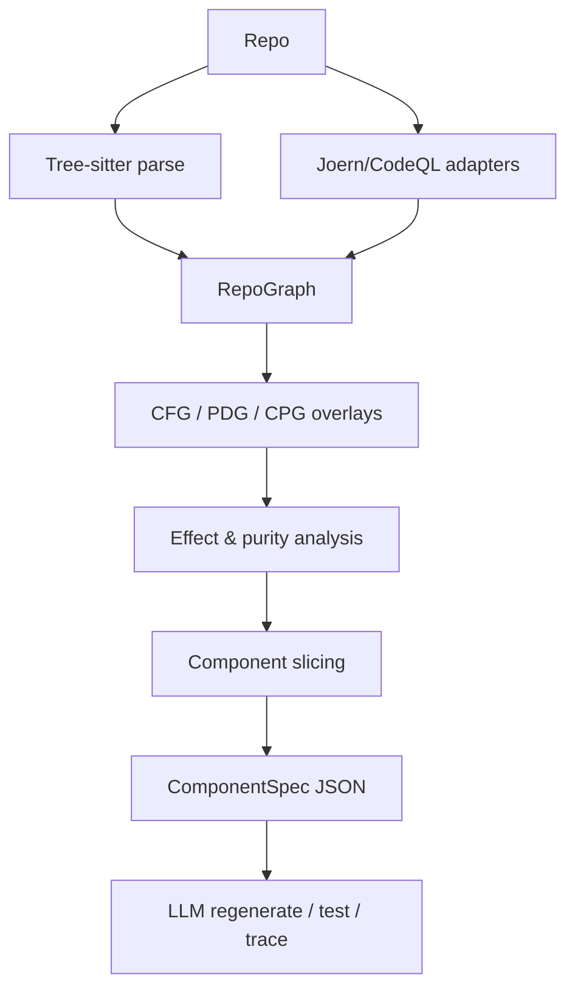
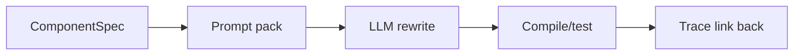

# CodeGraph IR Product Specification

## Executive summary

**Project name:** **CodeGraph IR**.  
**Vision:** transform a Python/TypeScript repository into small, traceable, language-agnostic **ComponentSpec** units that an LLM can rewrite, reassemble, and audit without holding the whole repo in context. This extends today’s repo-graph tools: Graphify builds a local knowledge graph from whole projects with Tree-sitter and exports `graph.json`/`graph.html`; Joern builds cross-language Code Property Graphs; CodeQL databases already expose AST, data-flow, and control-flow representations; RepoGraph and CodexGraph show that repository graphs improve retrieval for repo-scale coding. The product gap is a **semantic IR layer** above those graphs. citeturn4view0turn4view1turn4view2turn4view3turn4view4turn5view0

**Unspecified:** target org size, budget, exact timeline.

## Product scope

**Goals:** whole-repo graphing; interprocedural symbol/data-flow; side-effect and purity analysis; component slicing; traceability from source→graph→ComponentSpec→generated code; CLI/API usable by Codex or other agents.  
**Non-goals:** full compiler replacement, exact semantic equivalence for all dynamic/runtime features, build-system emulation, or perfect cross-language decompilation. Tree-sitter is excellent for incremental, error-tolerant parsing, but deeper semantics must come from extra passes; CodeQL databases are single-language snapshots, so CGIR must normalize above tool-specific schemas. citeturn7view0turn4view3

**Target users:** AI-tooling teams, platform engineers, migration/refactor teams, and maintainers of large Python/TypeScript repos.  
**Success metrics:** component coverage, purity/effect precision, source-to-spec trace completeness, regeneration compile/test pass rate, incremental re-index latency, and token reduction versus raw-file prompting. RepoGraph/CodexGraph are evidence that graph-structured repo context improves retrieval quality. citeturn4view4turn5view0

## Architecture and prioritized features



| Priority | Feature | Why |
|---|---|---|
| P0 | Parse + symbol table + call graph | foundation |
| P0 | Effect detection + purity scoring | enables “small pure-ish units” |
| P0 | ComponentSpec export | agent-facing contract |
| P1 | Interprocedural data-flow + reaching defs | variable reassignment lineage |
| P1 | Trace map + regeneration validation | trust and debugging |
| P2 | Neo4j explorer + CodeQL bridge | scale and query UX |

**Recommended stack:** Tree-sitter for fast local parsing and incremental refresh; Joern as the strongest whole-program graph substrate for CPG-style overlays; CodeQL as a secondary analyzer/export bridge; NetworkX for in-memory orchestration; Neo4j for persistent property-graph exploration. citeturn7view0turn4view2turn4view3turn2search3turn6view2

## Data model

**Internal nodes:** `Repository File Module Class Function Method Parameter Variable Assignment Expr Statement Branch Loop Return Import Effect Test`.  
**Edges:** `CONTAINS IMPORTS CALLS READS WRITES MUTATES RETURNS THROWS FLOWS_TO CONTROLS DEPENDS_ON TRACE_OF REGENERATED_AS`.

**ComponentSpec JSON Schema**
```json
{"type":"object","required":["id","kind","inputs","outputs","effects","calls","trace"],
"properties":{
"id":{"type":"string"},"kind":{"enum":["pure_function","state_transformer","effect_adapter","orchestrator","unknown"]},
"language":{"type":"string"},"signature":{"type":"string"},
"inputs":{"type":"array","items":{"type":"string"}},"outputs":{"type":"array","items":{"type":"string"}},
"effects":{"type":"array","items":{"type":"string"}},"calls":{"type":"array","items":{"type":"string"}},
"reads":{"type":"array","items":{"type":"string"}},"writes":{"type":"array","items":{"type":"string"}},
"purity":{"type":"number"},"pins":{"type":"array","items":{"type":"string"}},
"algorithm":{"type":"array","items":{"type":"string"}},
"trace":{"type":"array","items":{"type":"string"}}}}
```

`lexical_effects` marks the subset of `effects` backed only by lexical
(suffix/receiver-name) evidence — lower confidence, reported but not
build-failing by default. `pins` are developer-declared invariants extracted from `cgir:` comment
pragmas (`pure`, `no-<tag>`, `stable-signature`, `frozen`): state pins hold on
every scan; change pins hold across scan pairs and are always enforced.

**Example Python → ComponentSpec**
```python
def add_tax(price: float, rate: float) -> float: return price * (1 + rate)
```
```json
{"id":"pricing.add_tax","kind":"pure_function","language":"python","signature":"add_tax(price:float,rate:float)->float","inputs":["price","rate"],"outputs":["float"],"effects":[],"calls":[],"reads":[],"writes":[],"purity":1.0,"algorithm":["multiply price by 1+rate"],"trace":["pricing.py:1"]}
```
**Regenerated TypeScript stub**
```ts
export function addTax(price:number, rate:number): number { return price * (1 + rate); }
```

## Analysis, interfaces, and workflow

**Required analyses:** parsing, symbol resolution, cross-file import resolution, CFG, reaching definitions, PDG, CPG-style overlays, side-effect detection, purity scoring, and component slicing. Reaching definitions tracks which assignments may reach each use; PDGs make data and control dependencies explicit; Joern’s CPG lineage merges syntax, control flow, and data flow into one attributed multigraph. citeturn1search12turn1search2turn8view2

**CLI**
```bash
cgir scan <repo>
cgir export --format json|graphml|neo4j
cgir component <id>
cgir trace <source-loc>
cgir regenerate <id> --lang typescript
```

**API**
- `POST /scan`
- `GET /components/{id}`
- `GET /trace?path=&line=`
- `POST /regenerate`

**Exports:** `repo_graph.json`, `components/*.json`, GraphML, Neo4j import CSV, provenance map, prompt pack. Graphify already demonstrates useful HTML/JSON report patterns for graph export. citeturn4view0turn4view1

**Prompt template**
```text
Given ComponentSpec + dependent interfaces + tests, recreate this component in {target_language}. Preserve contracts, effects, and trace IDs. Do not invent hidden dependencies.
```



## Validation, risk, and roadmap

**Testing:** unit tests for parsers and classifiers; integration tests on fixture repos; differential tests against Joern/CodeQL outputs; regeneration correctness = compile + unit tests + behavior snapshots.  
**Performance:** incremental parsing/watch mode via Tree-sitter; content-hash re-indexing; in-memory NetworkX for small/medium repos, Neo4j or Joern backend for large repos. citeturn7view0turn2search3turn6view2

**Threat model / limitations:** dynamic dispatch, reflection, `eval`, monkeypatching, generated code, async race conditions, environment-dependent effects, and incomplete third-party source lower precision. Local-first parsing reduces code-exfiltration risk; Graphify explicitly emphasizes local AST extraction with no network in the AST pass. citeturn4view1

| Milestone | Effort |
|---|---:|
| MVP parse/graph/export | 4–6 weeks |
| Data-flow/effects/purity | 6–8 weeks |
| Component slicing/regeneration | 4–6 weeks |
| Scale/Neo4j/validation | 4–6 weeks |

**Priority sources to ground implementation:** Graphify repo/docs, Joern docs + CPG spec, CodeQL docs, Tree-sitter docs, RepoGraph, CodexGraph, Ferrante PDG paper, NetworkX docs, Neo4j docs. citeturn4view0turn4view2turn4view3turn7view0turn4view4turn5view0turn1search2turn2search3turn6view2